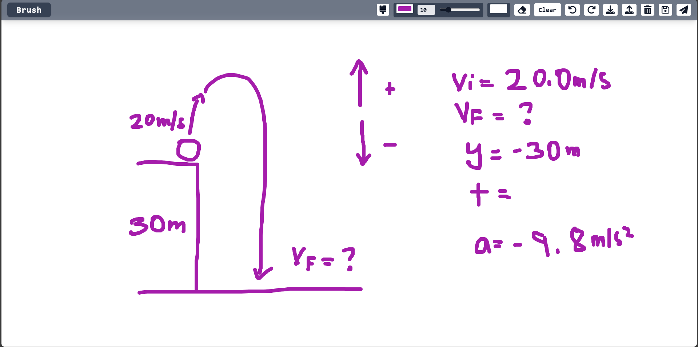

# AI Paint Calculator

AI Paint Calculator is a modern, responsive paint app that lets you draw math problems—expressions, geometry, calculus, and even physics—and instantly get answers using Google Gemini AI. Just draw your problem, hit send, and see the solution!

## Features

- 🎨 **Paint & Erase**: Draw with a brush or eraser, choose brush size and color.
- 🪣 **Background Color**: Change the canvas background color.
- 🧹 **Clear, Undo, Redo**: Full undo/redo stack and clear canvas.
- 💾 **Save/Load**: Save your drawing to local storage and load it back.
- 🖼️ **Download**: Download your drawing as an image.
- 📱 **Responsive UI**: Modern top bar, burger menu for mobile/square screens.
- 🖌️ **Color Pickers**: Popover color pickers for brush and background.
- 🔔 **Status Messages**: Temporary status messages for actions (undo, save, etc).
- 🤖 **AI Math Solver**: Instantly solve handwritten math, geometry, calculus, and physics problems—just draw and send!

## What Can It Solve?

- **Math Expressions**: PEMDAS, equations, variable assignments
- **Geometry**: Draw shapes, label values, get area, perimeter, etc.
- **Calculus**: Draw derivatives, integrals, limits, and get answers
- **Physics**: Draw diagrams (forces, angles, etc.) and get solutions

## Screenshots

### Math Expressions & Variables


### Physics Problem




## Usage

1. **Draw**: Use the brush or eraser to draw your math, geometry, or physics problem.
2. **Change Colors**: Click the color pickers to change brush or background color.
3. **Undo/Redo**: Use the undo/redo buttons to step through your drawing history.
4. **Save/Load**: Save your work to local storage and load it back later.
5. **Download**: Download your drawing as a PNG image.
6. **Send to AI**: Click the paper plane button to get instant answers from Gemini AI!

## Development

### Install dependencies

```
npm install
```

### Run the app

```
npm run dev
```

### Build for production

```
npm run build
```

## File Structure

- `src/App.jsx` — Main app logic, status messages, tool state
- `src/components/TopBar.jsx` — Responsive top bar, tool actions, burger menu
- `src/components/CanvasArea.jsx` — Canvas drawing logic, undo/redo, resizing
- `src/components/ColorPickerPopover.jsx` — Popover color picker logic
- `src/components/Modal.jsx` — Animated modal for AI results

## Contributing

Pull requests are welcome! For major changes, please open an issue first to discuss what you would like to change.

## License

MIT
